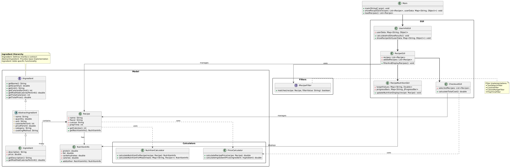

Project: Food online shopping tool (Calorie tracking)  
Team members: Yinfei Lu, Xuanyou Liu  
Elevator Pitch:  
Food has always been a cornerstone of daily life, and today, it’s more important than ever to eat both healthily and enjoyably. Yet, with today’s fast-paced lifestyles, people often lack the time and energy to shop locally or plan meals. That’s why our team of two food enthusiasts is developing an online shopping tool that empowers users to quickly select products tailored to their personal preferences—making healthy, satisfying eating effortless and accessible.
________________

Project Functionalities:
* Personalized Recipe Suggestions: Generate recipes based on user preferences, such as cuisine type (e.g., Chinese, Indian, American, Mexican), flavor profiles (e.g., simple or complex), or calorie goals.
* Flexible Meal Planning: Allow users to customize daily meals by cuisine, flavor, or nutritional targets, with options adjusted to their schedule and dietary needs.
* Smart Cooking Adjustments: Adapt cooking methods (e.g., steaming vs. frying a potato) to meet calorie targets or time constraints, optimizing both health and convenience.
Target Customer:
* Busy individuals who love food but lack time to browse recipes online.
* People with specific dietary goals, such as weight loss or muscle gain, who want variety without the hassle.
________________

Target Value:

Our tool helps users eat healthily by meeting their calorie goals while ensuring they eat well—moving beyond repetitive, bland options like boiled chicken and broccoli to flavorful, satisfying meals.
________________

What Sets Us Apart:

Unlike most apps that focus solely on calorie tracking or taste, our product seamlessly integrates both. This dual approach offers greater flexibility, balancing nutrition and enjoyment for a more personalized food experience.

Class diagram:

